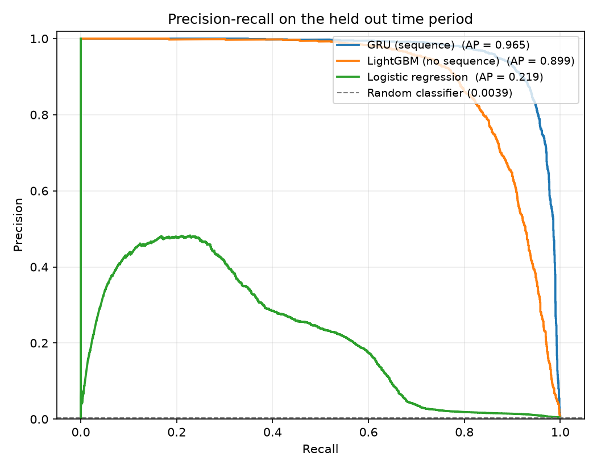
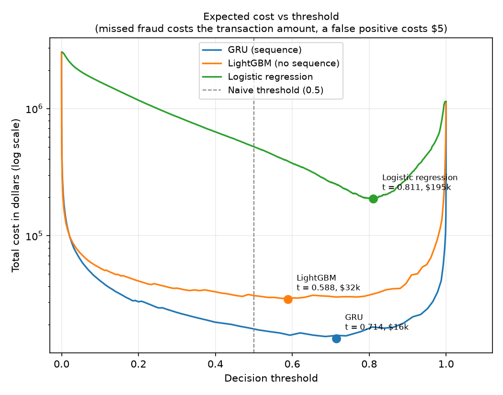
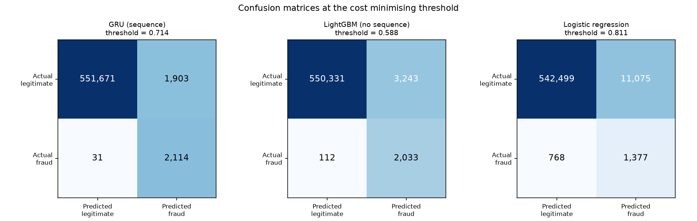
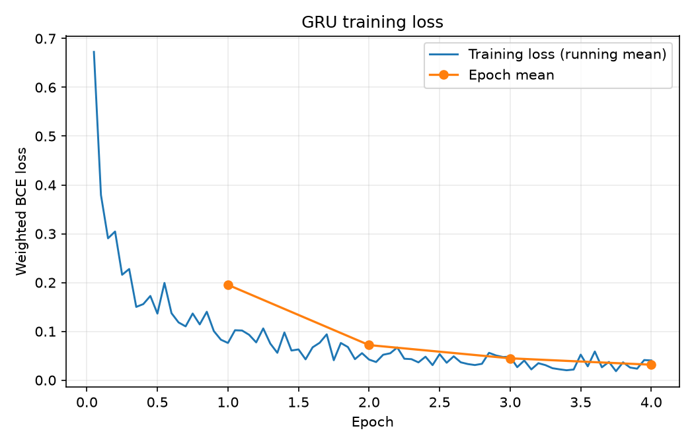

# Sequential Fraud Detection

Sequence models for credit card fraud detection, with cost-sensitive threshold selection and a gradient boosting baseline.

**Headline result:** a small GRU that reads each card's last 10 transactions reaches **0.965 PR-AUC** against **0.899** for a LightGBM model given the identical features without sequence context. At the cost-minimising threshold the GRU misses **31** of 2,145 frauds where LightGBM misses **112**, cutting total cost from **$31,707** to **$15,549**.

---

## 1. The problem, and why sequence context matters

Most credit card fraud models score each transaction in isolation: amount, merchant category, time of day, distance from home. That framing throws away the thing a human analyst actually looks at. A $400 electronics purchase at 2am is unremarkable for one cardholder and a screaming anomaly for another. Fraud is not a property of a transaction. It is a property of a transaction *relative to the behaviour of that card*.

This project makes that relationship explicit. For every transaction it builds the sequence of that card's last 10 transactions and feeds the sequence to a GRU, so the model can learn what "normal" looks like per card rather than in aggregate. To find out whether the sequence is actually earning its keep, the same engineered features are handed to a gradient boosting model that sees only the current transaction, and to a logistic regression as a floor.

Evaluation follows how a fraud team buys a model, not how a Kaggle leaderboard ranks one: precision-recall over accuracy, recall at a fixed alert budget, and a decision threshold chosen by minimising expected dollar cost.

---

## 2. Dataset

[Kaggle: Credit Card Transactions Fraud Detection Dataset](https://www.kaggle.com/datasets/kartik2112/fraud-detection) (Sparkov simulator, Kartik Shenoy)

| | |
|---|---|
| Transactions | 1,852,394 |
| Period | January 2019 to December 2020 |
| Cardholders / merchants | 1,000 / 800 |
| Overall fraud rate | 0.52 percent |
| Missing values | none |

The data ships as two files already separated in time, which is exactly what this problem needs.

| Split | Rows | Period | Frauds | Fraud rate |
|---|---|---|---|---|
| Train | 1,296,675 | 2019-01-01 to 2020-06-21 | 7,506 | 0.579 percent |
| Test | 555,719 | 2020-06-21 to 2020-12-31 | 2,145 | 0.386 percent |

It was chosen over IEEE-CIS and the classic ULB `creditcard.csv` for three reasons: it carries a real card identifier and timestamp, so per-card sequences are possible at all; it is already split chronologically, so the correct evaluation is also the default one; and it needs almost no cleaning.

**Columns dropped:** `first`, `last`, `gender`, `street`, `city`, `state`, `zip`, `job`, `trans_num`, `unix_time`. These are identifiers or near-identifiers with no generalisable signal. Keeping a per-cardholder identifier lets the model memorise individuals instead of learning behaviour, and `trans_num` is a primary key that a tree model would gleefully overfit.

---

## 3. Approach

### 3.1 Every derived feature is causal

Ten features are engineered per transaction:

| Feature | Notes |
|---|---|
| `log_amt` | log1p of the amount |
| `log_hours_since_prev` | time since that card's previous transaction |
| `hour_of_day`, `day_of_week` | raw calendar values, usable by the tree model |
| `hour_sin`, `hour_cos` | cyclic encoding, so hour 23 sits next to hour 0 rather than 23 units away |
| `log_amt_vs_card_mean` | amount divided by that card's expanding mean amount |
| `log_distance_km` | haversine distance between cardholder and merchant |
| `log_city_pop` | log1p of city population |
| `age` | age at the time of the transaction, not age today |
| `category` | integer encoded, fed to a 16-dimensional embedding |

The constraint that governs all of them: **every rolling or expanding statistic uses only transactions strictly before the one being described.** A single non-causal aggregate leaks the future into the past and silently inflates every metric downstream.

Two places where this is load-bearing:

- `log_hours_since_prev` uses `groupby(card).shift(1)`, which looks strictly backwards.
- `log_amt_vs_card_mean` divides by an expanding mean built from prior rows only, computed as `(cumsum - current) / (count_before)`. If the current amount contributed to its own baseline, a large fraudulent charge would partly normalise itself away.

Feature standardisation is fit on the **training rows only** and then applied to both splits. Fitting the scaler on the full dataset is a quieter form of the same leak.

### 3.2 The split is chronological, and defined by timestamp

The train/test boundary is the last timestamp in `fraudTrain.csv` (2020-06-21 12:13:37). Splitting on the timestamp rather than on the source file makes a useful guarantee provable rather than assumed: **every test row is strictly later than every training row.**

That guarantee is what makes one design choice safe. Features and sequence windows are computed over the concatenated, time-sorted data, so a test transaction's window can look backwards into the training period. This is deliberate and it is not leakage. At scoring time in production, the card's history genuinely exists; a real system would use it. Looking backwards is legitimate, looking forwards is not, and sorting by timestamp is what lets the code enforce the distinction.

A random train/test split, by contrast, is the single most common fatal flaw in student fraud projects. It lets the model see a card's future behaviour while scoring its past.

### 3.3 Sequence windows are built on demand, never materialised

For each transaction the model sees that card's last 10 transactions including the current one, left-padded where a card has less history.

The naive implementation allocates an array of shape (1.29M sequences, 10 timesteps, 11 features), duplicating the dataset tenfold for no benefit. Instead the project keeps **one flat float32 array per split** and slices the window inside `Dataset.__getitem__`. The only extra state needed is `block_start`, recording where each card's contiguous block of rows begins, which stops a window from running off the start of a card and picking up a different cardholder's history.

The whole pipeline stays comfortable in 16 GB, and the feature cache is 120 MB.

A validity flag is appended as an extra input channel, marking real timesteps against padded ones. Without it the model cannot distinguish a padded step from a real transaction whose standardised features happen to sit at the mean. Category index 0 is reserved for padding, with `padding_idx=0` pinning its embedding at zero.

### 3.4 Models

**GRU (22,577 parameters).** A 16-dimensional embedding for merchant category and a linear projection of the 11 numeric channels are concatenated per timestep and fed to a single-layer GRU with hidden size 64. The hidden state at the final timestep passes through dropout (0.2) and a linear head to one logit. Trained with `BCEWithLogitsLoss` and `pos_weight = 171.8` (the negative to positive ratio), Adam at 1e-3, batch size 512, 4 epochs.

The network is deliberately small. The point is to isolate the value of sequence context, not to win a capacity contest; a larger model would confound the two.

**LightGBM.** Same features, current transaction only. 300 trees, `scale_pos_weight` set to the same class ratio so neither model gains an advantage purely from how imbalance was handled.

**Logistic regression.** Same features with one-hot categories, `class_weight="balanced"`. Present as a floor.

**What this comparison actually isolates.** The baselines are not blind to history: `log_hours_since_prev` and `log_amt_vs_card_mean` are hand-crafted summaries of the past, and both baselines get them. So this does not test "does history help". It tests the narrower and more defensible question: **does modelling the sequence explicitly add anything beyond hand-crafted history features?** The answer here is yes, and by a wide margin.

Everything ran on CPU only, on an Acer Aspire laptop with an i5-1235U and no GPU. Training took 7.1 minutes.

---

## 4. Results

Held out period, 555,719 transactions, 2,145 frauds (0.386 percent).

| Model | PR-AUC | ROC-AUC | Recall @ 0.1% | Recall @ 1% | Cost at best threshold |
|---|---|---|---|---|---|
| **GRU (sequence)** | **0.9652** | 0.9992 | 0.259 | **0.989** | **$15,549** |
| LightGBM (no sequence) | 0.8985 | 0.9974 | 0.259 | 0.950 | $31,707 |
| Logistic regression | 0.2190 | 0.9196 | 0.117 | 0.554 | $194,944 |

**Accuracy is not in that table on purpose.** A model that predicts "legitimate" for every transaction scores **99.614 percent accuracy** on this test set while catching zero fraud. Any fraud project that leads with accuracy is reporting the base rate.

**Why ROC-AUC is reported but demoted.** All three models look respectable on ROC-AUC, including logistic regression at 0.9196, which is in fact close to useless here. At a 0.386 percent base rate the negative class dominates the false positive rate, so ROC-AUC flatters everything. PR-AUC separates the same three models by 0.75.

**Reading the alert budget columns.** Recall at 0.1 percent is capped at 25.9 percent for every model, because 0.1 percent of 555,719 transactions is 556 alerts and there are 2,145 frauds. No model can catch more than 556 of them. Both the GRU and LightGBM saturate that ceiling, and the interesting number is precision inside it: the GRU's top 556 scored transactions are **100.0 percent fraud**, LightGBM's are 99.8 percent. The models separate at the 1 percent budget, where the GRU recovers 98.9 percent of fraud against 95.0 percent.



---

## 5. Cost analysis

Ranking metrics do not tell an operations manager where to set the alert threshold. This does.

**Assumptions, stated plainly:** a missed fraud costs the full transaction amount. A false positive costs a fixed **$5** manual review. Total fraud exposure in the test period is $1,133,325.

Sweeping every possible cutoff and taking the minimum:

| Model | Best threshold | Alert rate | Frauds caught | Frauds missed | False positives | Total cost | Cost at naive 0.5 | Saved |
|---|---|---|---|---|---|---|---|---|
| **GRU** | 0.714 | 0.72% | 2,114 | **31** | 1,903 | **$15,549** | $18,507 | $2,958 |
| LightGBM | 0.588 | 0.95% | 2,033 | 112 | 3,243 | $31,707 | $33,922 | $2,215 |
| Logistic regression | 0.811 | 2.24% | 1,377 | 768 | 11,075 | $194,944 | $501,629 | $306,685 |





Three things worth drawing out:

1. **Sequence context roughly halves the cost.** $31,707 to $15,549, driven by missing 31 frauds instead of 112 while raising *fewer* false positives (1,903 against 3,243). The GRU is better on both axes at once, not trading one for the other.

2. **The default 0.5 threshold is never the right answer, but how wrong it is depends on the model.** It costs the GRU $2,958 and logistic regression $306,685. A well-separated model is forgiving of a badly chosen threshold; a weak one is not. That is an argument for doing the cost sweep precisely when your model is mediocre.

3. **The optimal alert rate is around 0.7 percent, not 50 percent.** With a $5 review cost against an average fraud of roughly $528, the economics justify reviewing far more aggressively than a probability of 0.5 implies. The threshold is a business parameter, not a modelling constant.



---

## 6. Limitations

Stated plainly, because these bound what the numbers above are worth.

1. **The data is simulated, not real.** Sparkov generates fraud from rules, and rule-generated fraud is far more learnable than the adversarial kind. A PR-AUC of 0.965 is not a number any production fraud system achieves. The *relative* comparison between the three models is the meaningful output here; the absolute values are not transferable.

2. **The threshold is selected on the test set.** The cost-minimising cutoff is found by sweeping the same data the cost is then reported on, which makes those dollar figures an optimistic estimate of what is achievable. A production version would carve a validation window out of the training period, pick the threshold there, and report cost on the test window only.

3. **No hyperparameter search.** Sequence length, hidden size, learning rate, tree count: all fixed at reasonable first guesses. Neither model has been tuned, so the comparison is fair, but neither is at its ceiling.

4. **A single time split, and a single seed.** There are no confidence intervals. The GRU-versus-LightGBM gap is wide enough to be believable, but one split cannot quantify its variance.

5. **There is real distribution shift across the split that is not modelled.** The fraud rate falls from 0.579 percent in training to 0.386 percent in test. The models are evaluated straight through it without recalibration, which is realistic, but the shift is not analysed.

6. **The cost model is a simplification.** Real fraud economics include chargeback fees, partial recovery, and the customer churn caused by false declines, none of which are a flat $5.

7. **Merchant identity is unused.** 800 merchants are available and a merchant embedding would likely help. It was cut for scope.

---

## 7. Repository structure

```
DL-based-sequential-fraud-detection/
├── README.md
├── requirements.txt
├── .gitignore
├── data/                      gitignored, holds the two CSVs
├── cache/                     gitignored, feature arrays and model scores
├── src/
│   ├── config.py              paths and hyperparameters, no absolute paths
│   ├── features.py            causal feature engineering
│   ├── dataset.py             on-demand sequence windowing
│   ├── model.py               the GRU
│   ├── train.py               GRU training loop
│   ├── baselines.py           LightGBM and logistic regression
│   └── evaluate.py            metrics, cost analysis, plots
└── results/
    ├── pr_curve.png
    ├── cost_curve.png
    ├── confusion_matrix.png
    ├── loss_curve.png
    ├── metrics.json
    └── screenshots/
```

---

## 8. Reproducing this

```bash
git clone https://github.com/adwitiyashukla/DL-based-sequential-fraud-detection.git
cd DL-based-sequential-fraud-detection

python -m venv .venv
.venv\Scripts\activate           # Windows
source .venv/bin/activate        # macOS or Linux

pip install torch --index-url https://download.pytorch.org/whl/cpu
pip install -r requirements.txt
```

PyTorch is installed first from its CPU-only index. The default PyPI wheel is the CUDA build at roughly 2.5 GB, which is dead weight without an NVIDIA GPU; the CPU wheel is about 200 MB.

Download the [dataset](https://www.kaggle.com/datasets/kartik2112/fraud-detection) (a free Kaggle account is required) and unzip so that `data/fraudTrain.csv` and `data/fraudTest.csv` exist. Then:

```bash
python -m src.features      # about 3 minutes, writes cache/features.npz
python -m src.train         # about 7 minutes on CPU
python -m src.baselines     # about 15 seconds
python -m src.evaluate      # prints the results table, writes results/
```

Useful flags if you are time constrained:

```bash
python -m src.train --epochs 3 --subsample-neg 0.1
```

`--subsample-neg` keeps every fraud and the given fraction of legitimate rows, for training only. The test set is never subsampled, because the metrics are only meaningful at the true base rate.

Timings above are from an Acer Aspire A315-59: i5-1235U, 16 GB RAM, no GPU.

---

## Author

Adwitiya Shukla
